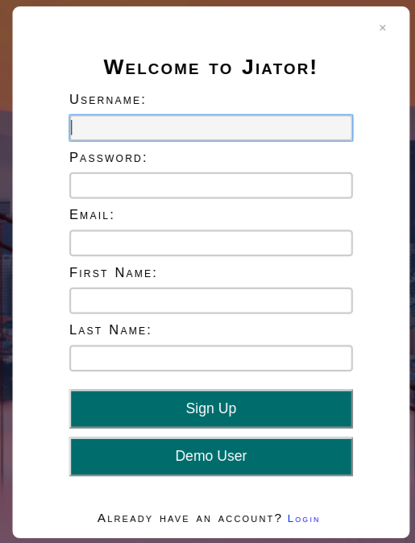
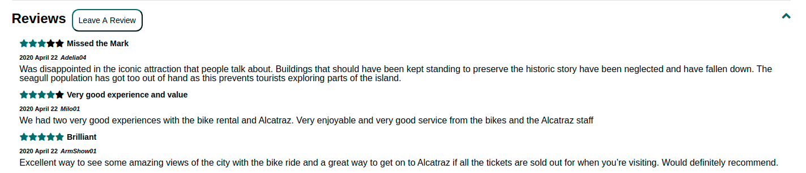

# Jiator 
App Academy - Full Stack Project 

[View the live site ](https://jiator.herokuapp.com/#/)

Jiator, inspired by [Viator](https://www.viator.com/), is the world leader in offering amazing tours, activities, and travel experiences around the world

# Technologies Used

## Backend 
* Ruby on Rails 
* PostgreSQL

## Frontend
* React/Redux

## Other
* Rails Active Storage
* Amazon S3
* CSS
* Webpack
* Heroku

# Features 
* User authentication 
* Tour Listings 
* Reviews 

## User Authentication
Users can create an account and log in. User authentication for this web application was made using the BCrypt gem and SecureRandom module.

## Tours 
Tours are listed for booking.

Tour listings include: price, overview, included features, additional info, spaces available, length of time, and languages available in.

## Reviews 
Reviews are listed by tour. Reviews include: rating, timestamp, username, title and body.

